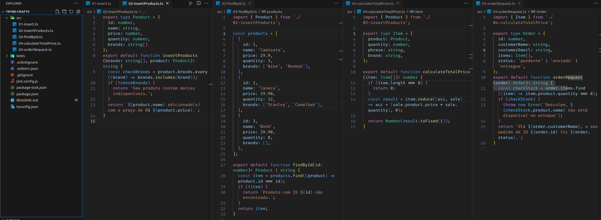

# README: Products List



## Project Description

This is my first project using TypeScript for the backend module. The purpose of this exercise is to write functions for adding and finding products, as well as handling order requests.

### Technologies

- LINUX
- VSCODE
- TYPESCRIPT


### What I Learned

- How to set typescript configurations in tsconfig.json
- How to use type notations and type unions in typescript

## How to Run the Project

1. Clone the repository:

   ```bash
   git clone https://github.com/feduarte-dev/trybe-crafts
   ```

2. Navigate to the project directory:

   ```bash
   cd your-repository
   ```

3. Install dependencies:

   ```bash
   npm install
   ```

4. Test the application:

   ```bash
   npm test
   ```

## Contributions

[Felipe](https://www.linkedin.com/in/feduarte-dev/) -  /src


[Trybe](https://www.betrybe.com/) - Everything else
